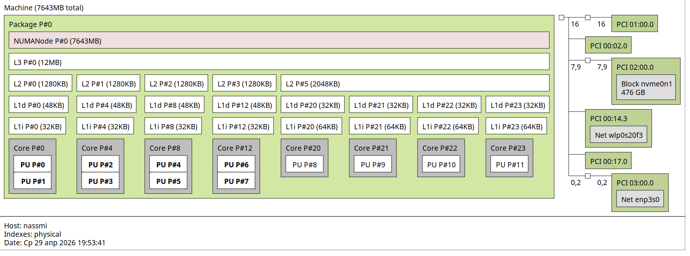
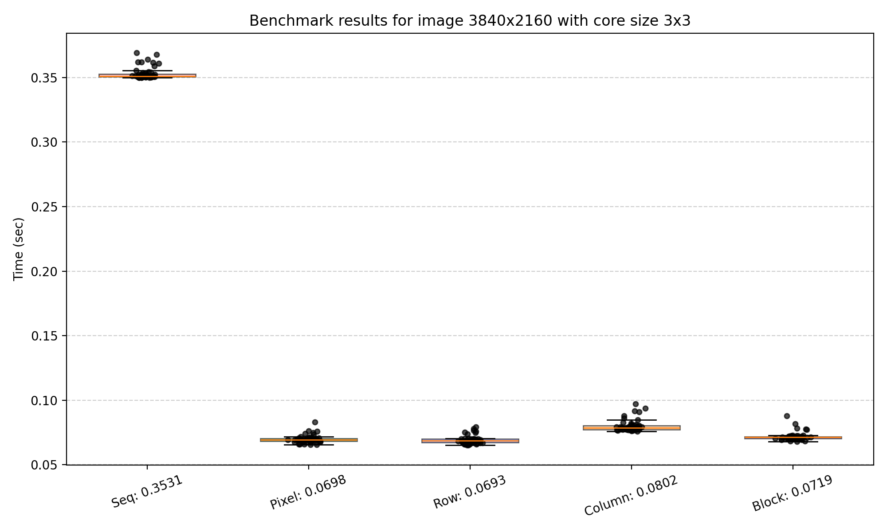
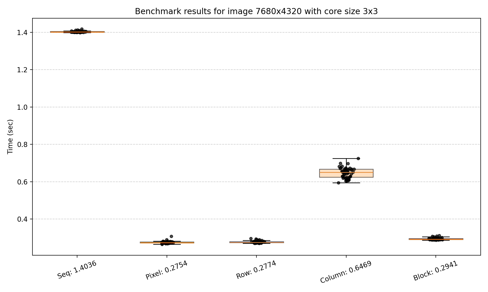

# Conv
Apply convolution filters (blur, sharpen, edge detection, etc.) to images
## Usage
```
conv --input=<input_file> --filter=<filter> --size=<size> --mode=<mode> [--clean]
```
_The utility has no required arguments. All settings are optional and have default values._

#### Options
| Option | Default | Possible values |
|--------|---------|-----------------|
| `--input` | First image in `./images` directory | Name of image file inside `./images` (e.g., `photo.jpg`) |
| `--filter` | `blur` | `blur`, `sharpen`, `edge`, `emboss`, `motion` |
| `--size` | `3` | Any odd number from 3 to 13 |
| `--mode` | `seq` | `seq`, `pixel`, `row`, `column`, `block` |

#### Flags

| Flag | Description |
|------|-------------|
| `--clean`, `-c` | Remove all files from the `./output` directory before writing new results |
| `--help`, `-h` | Print help information with all available options and flags |

## Quick Start

### Build and run conv

```bash
cd ./build
cmake ..
make build
./conv
```
### Run benchmarks
```bash
# inside ./build after cmake ..
make bench
```
### Run tests
```bash
# inside ./build after cmake ..png
make test
```
## Benchmarks
### Cache configuration
<p align="center">
  
  <br>
  <em>The benchmarks were conducted on the following system:</em>
</p>

###### **12 logical cores - the ability to run 12 threads in parallel

### Benchmark results

#### Bench 1
<p align="center">
  
  <br>
  <em>Small image + small core</em>
</p>

#### Bench 2
<p align="center">
  
  <br>
  <em>Medium image + medium core</em>
</p>

#### Bench 3
<p align="center">
  
  <br>
  <em>Big image + small core</em>
</p>


## Analysis

#### Row mode

* Row mode makes the best use of spatial cache locality, resulting in the fewest cache misses. It consistently delivers the best performance across all image sizes and kernel sizes.

#### Column mode

* For relatively small images (those that fit into the cache of the test hardware), column mode performs comparably to row and block modes. However, for large images that exceed cache capacity, its performance degrades significantly — becoming more than twice as slow as row and block modes.

#### Block mode

* Block mode demonstrates strong performance on images of any size, achieving results comparable to row mode. It also exhibits good spatial locality, making it a reliable choice across different workloads.

#### Pixel mode

* This parallelization strategy provides no speedup compared to the sequential implementation. In some cases, it is even slightly slower due to the high overhead of parallelization at the individual pixel level.
