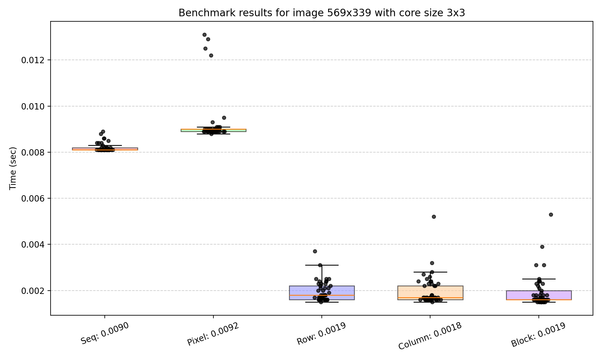
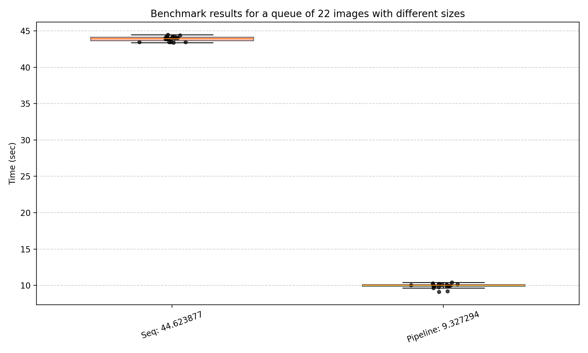
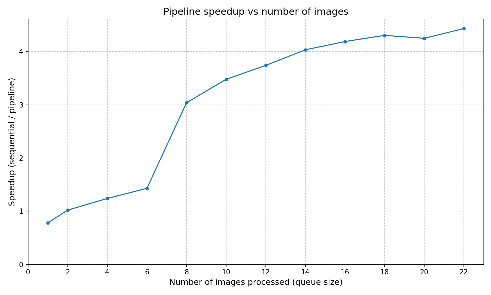

# Conv
Apply convolution filters (blur, sharpen, edge detection, etc.) to images
## Usage
```
conv --input=<input_file> --filter=<filter> --size=<size> --mode=<mode> [--queue] [--clean]
```
_The utility has no required arguments. All settings are optional and have default values._

#### Options
| Option     | Default                             | Possible values                                          |
| ---------- | ----------------------------------- | -------------------------------------------------------- |
| `--input`  | First image in `./images` directory | Name of image file inside `./images` (e.g., `photo.jpg`) |
| `--filter` | `blur`                              | `blur`, `sharpen`, `edge`, `emboss`, `motion`            |
| `--size`   | `3`                                 | Any odd number from 3 to 13                              |
| `--mode`   | `seq`                               | `seq`, `pixel`, `row`, `column`, `block`                 |

#### Flags

| Flag            | Description                                                               |
| --------------- | ------------------------------------------------------------------------- |
| `--queue`, `-q` | Enable queue-based pipeline processing (reader → convolution → writer)    |
| `--clean`, `-c` | Remove all files from the `./output` directory before writing new results |
| `--help`, `-h`  | Print help information with all available options and flags               |

## Quick Start

Before running conv, benchmarks or tests, create an `images` directory in `build` directory and add at least one image file (`.png`, `.jpg`, `.jpeg`, or `.bmp`).

### Build and run conv

```bash
mkdir build
cd ./build
cmake ..
make build
./conv
```
### Run benchmarks

The project includes three benchmark suites:

1. **Single‑image convolution** 
  
  ```bash
  # inside ./build after cmake ..
  make bench_task2
  ```  
   Compares different parallelisation strategies (rows, columns, pixels, blocks).

2. **Pipeline processing** 
  ```bash
  # inside ./build after cmake ..
  make bench_task3
  ```   
   Parallel pipeline vs sequential.

3. **Common convolution parameters tuning**
  ```bash
  # inside ./build after cmake ..
  make bench_setup
  ```  
   Finds optimal values for `grid_granularity_k` and `task_granularity_k`. 
   (see [task_granularity_analysis.md](./benchmarks/results/task_granularity_analysis.md) and [grid_granularity_analysis.md](./benchmarks/results/grid_granularity_analysis.md))

#### Run bench_task2 with custom parameters

You can override default parameters using CMake variables:

| Variable            | Description                                                             | Default                             |
| ------------------- | ----------------------------------------------------------------------- | ----------------------------------- |
| `-DMY_BENCH_SIZE`   | Kernel size (odd number from 3 to 13)                                   | `3`                                 |
| `-DMY_BENCH_FILTER` | Filter type (`blur`, `sharpen`, `edge`, `emboss`, `gaussian`, `motion`) | `blur`                              |
| `-DMY_BENCH_INPUT`  | Input image name (must be in `./images/` directory)                     | first image in `./images` directory |

> Note: All MY_BENCH_* variables are optional. Only pass the ones you need to change.

Usage:

```bash
# inside ./build
cmake -DMY_BENCH_SIZE=<kernel_size> -DMY_BENCH_FILTER=<filter> -DMY_BENCH_INPUT=<name_of_input_image> ..
make bench_task2
```

Example:

```bash
# inside ./build
cmake -DMY_BENCH_SIZE=7 -DMY_BENCH_INPUT=300x120.jpg ..
make bench_task2
```

### Run tests
```bash
# inside ./build after cmake ..
make test
```
## Benchmarks

### Cache configuration
<p align="center">
  
  <br>
  <em>The benchmarks were conducted on the following system:</em>
</p>

###### **12 logical cores - the ability to run 12 threads in parallel

### Benchmark results
#### Benchmarks for Single‑image convolution
##### Bench 1
<p align="center">
  
  <br>
  <em>Small image + small core</em>
</p>

##### Bench 2
<p align="center">
  
  <br>
  <em>Medium image + medium core</em>
</p>

#### Bench 3
<p align="center">
  
  <br>
  <em>Big image + small core</em>
</p>


#### Analysis

##### Row mode

* Row mode makes the best use of spatial cache locality, resulting in the fewest cache misses. It consistently delivers the best performance across all image sizes and kernel sizes.

##### Column mode

* For relatively small images (those that fit into the cache of the test hardware), column mode performs comparably to row and block modes. However, for large images that exceed cache capacity, its performance degrades significantly — becoming more than twice as slow as row and block modes.

##### Block mode

* Block mode demonstrates strong performance on images of any size, achieving results comparable to row mode. It also exhibits good spatial locality, making it a reliable choice across different workloads.

##### Pixel mode

* This parallelization strategy provides no speedup compared to the sequential implementation. In some cases, it is even slightly slower due to the high overhead of parallelization at the individual pixel level.

#### Benchmarks for Pipeline processing

##### Bench 1
<p align="center">
  
  <br>
</p>

###### Analysis
* Sequential processing: ≈ 44.6 seconds

* Pipeline processing: ≈ 9.3 seconds

* Speedup: the pipeline processes the same queue about **4.8×** faster than the sequential version.

**Conclusion**: Even for a moderately sized queue (22 images), the pipeline provides a significant performance gain.

##### Bench 2
<p align="center">
  
  <br>
</p>
  
###### Analysis
* **X‑axis**: number of images in the queue (0, 2, 4, …, 22)

* **Y‑axis**: speedup (sequential time / pipeline time)

**Trend**: speedup increases rapidly after 2–4 images, then stabilises around 3.8–4.2.

**Reason**: With a very short queue, the pipeline is underutilised (stages frequently idle), limiting the speedup. As the queue grows, the pipeline fills up, resulting in a steady increase in speedup. The improvement per added image gradually diminishes, but overall performance continues to gain until near-saturation is reached.